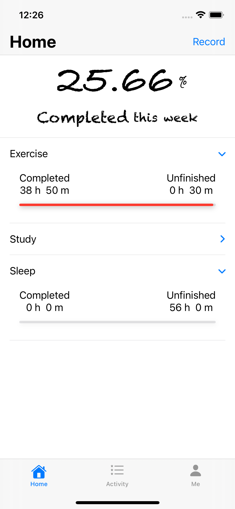
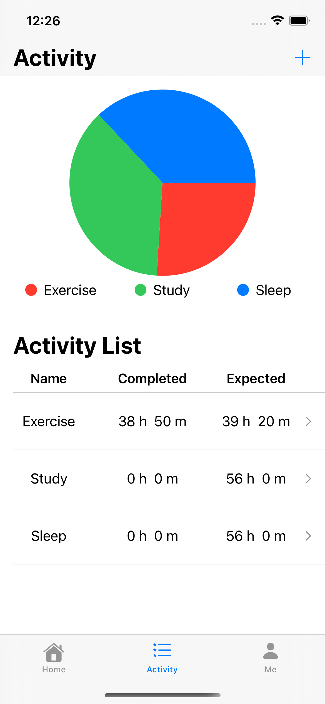
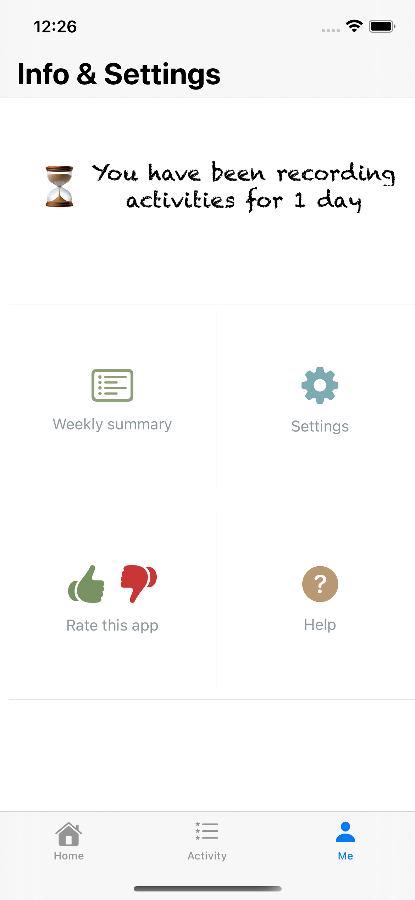
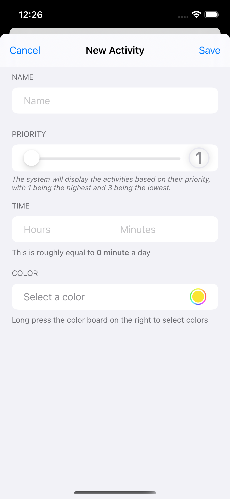
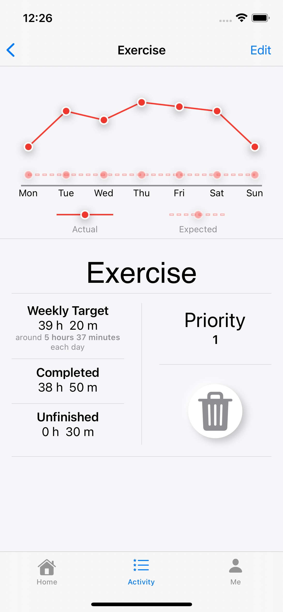
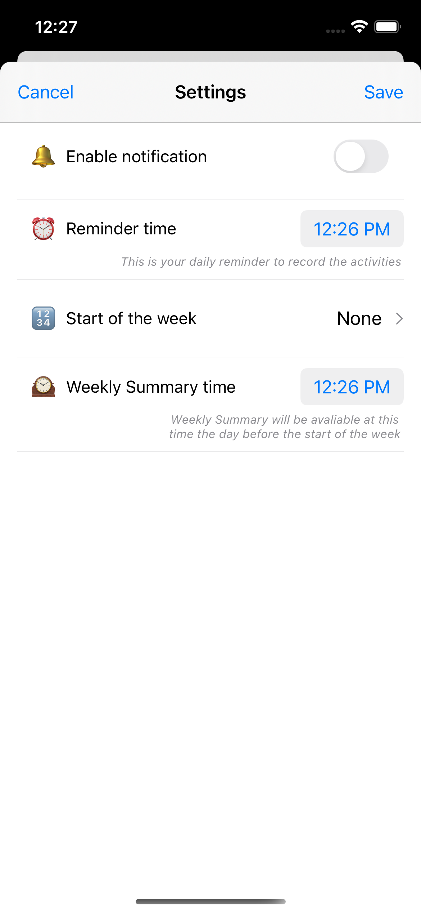
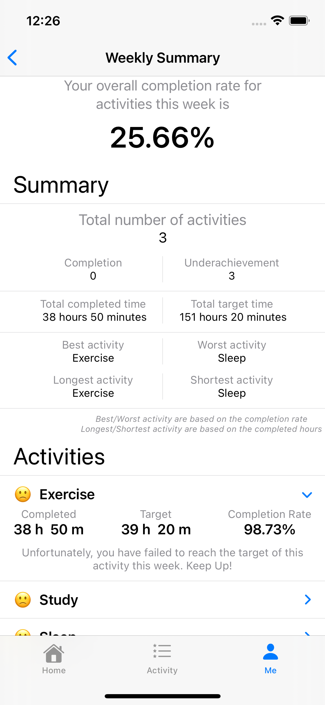

# TimeTracker

## Project Description
TimeTracker is an app developed for the iOS platform. It aims to help people track their time by recording and analysing the time spent on each activity on a weekly basis.

## Languages and Tools
*Swift, SwiftUI, Xcode*

## Some Screenshots

Home Page                  |  Activity Main Page       |  Setting Main Page
:-------------------------:|:-------------------------:|:-------------------------:
  |  | 

---

Add Activity Page          |  Detailed Activity Page   |  Detailed Setting Page    |  Weekly Summary Page
:-------------------------:|:-------------------------:|:-------------------------:|:-------------------------:
  |  |  |  |
